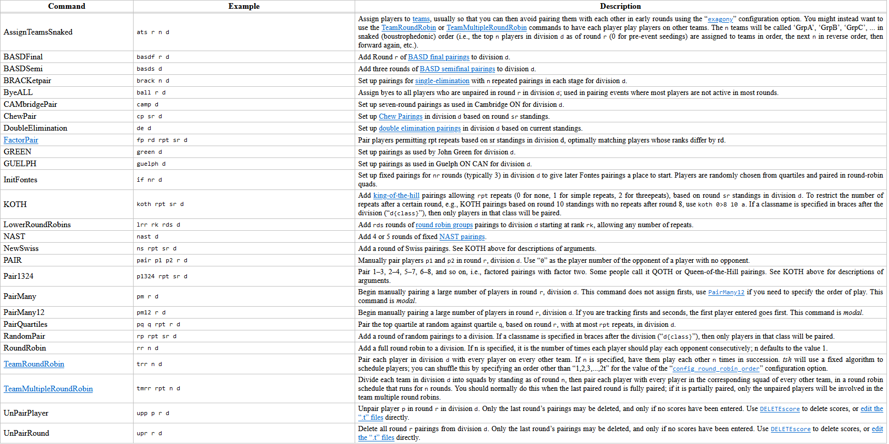
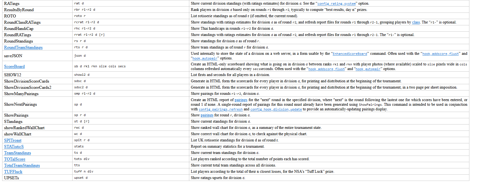
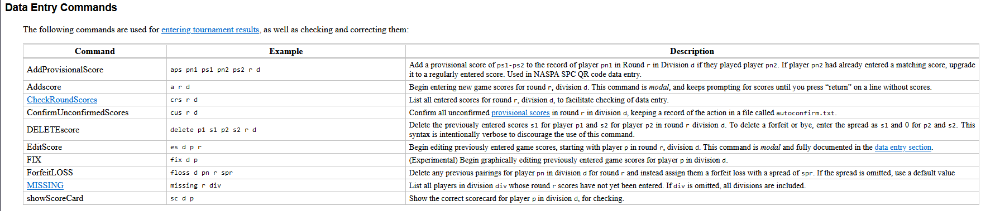

to pair a round with swiss: `ns rpt sr d`
`rpt = repeats | sr = based on standings from`

`sp [round number]` : to show the pairings
`st [round number]` : to show the standings
`upr [round number]` : to unpair a round
`rs [round number]`: round standings

`a [round number]` : to enter scores for players for that round
`crs [round number]` : check round scores
`es [player id] [round]` : edit scores for a player in a round
